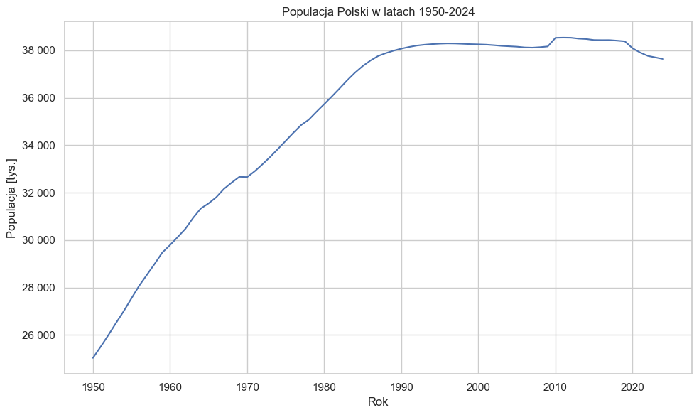

```python
import pandas as pd
import numpy as np
import seaborn as sns
import matplotlib.pyplot as plt
from matplotlib.ticker import FuncFormatter
import warnings
from utils.plot import format_with_space
from utils.preprocessing import PopulationDataProcessor

warnings.filterwarnings("ignore")
sns.set_theme(style="whitegrid") 
```


```python
data_path = '../data'
historical_data_filename = 'tablica_2.xls'
recent_data_filename = 'tabl07_stan_i_ruch_naturalny_ludnosci.xlsx'

preprocessor = PopulationDataProcessor(f'{data_path}/{historical_data_filename}', f'{data_path}/{recent_data_filename}')
hist_df, data = preprocessor.get_data()
```


```python
data
```


<div>
<style scoped>
    .dataframe tbody tr th:only-of-type {
        vertical-align: middle;
    }

    .dataframe tbody tr th {
        vertical-align: top;
    }

    .dataframe thead th {
        text-align: right;
    }
</style>
<table border="1" class="dataframe">
  <thead>
    <tr style="text-align: right;">
      <th></th>
      <th>rok</th>
      <th>populacja</th>
      <th>przyrost_naturalny</th>
    </tr>
  </thead>
  <tbody>
    <tr>
      <th>0</th>
      <td>1950</td>
      <td>25035.0</td>
      <td>474.4</td>
    </tr>
    <tr>
      <th>1</th>
      <td>1951</td>
      <td>25507.0</td>
      <td>471.3</td>
    </tr>
    <tr>
      <th>2</th>
      <td>1952</td>
      <td>25999.0</td>
      <td>492.3</td>
    </tr>
    <tr>
      <th>3</th>
      <td>1953</td>
      <td>26511.0</td>
      <td>512.5</td>
    </tr>
    <tr>
      <th>4</th>
      <td>1954</td>
      <td>27012.0</td>
      <td>501.7</td>
    </tr>
    <tr>
      <th>...</th>
      <td>...</td>
      <td>...</td>
      <td>...</td>
    </tr>
    <tr>
      <th>70</th>
      <td>2020</td>
      <td>38089.0</td>
      <td>-122.0</td>
    </tr>
    <tr>
      <th>71</th>
      <td>2021</td>
      <td>37908.0</td>
      <td>-188.0</td>
    </tr>
    <tr>
      <th>72</th>
      <td>2022</td>
      <td>37766.0</td>
      <td>-143.3</td>
    </tr>
    <tr>
      <th>73</th>
      <td>2023</td>
      <td>37637.0</td>
      <td>-136.6</td>
    </tr>
    <tr>
      <th>74</th>
      <td>2024</td>
      <td>37557.0</td>
      <td>-156.9</td>
    </tr>
  </tbody>
</table>
<p>75 rows × 3 columns</p>
</div>


```python
pd.set_option('display.max_columns', None)
data = pd.read_excel('../data/tabl07_stan_i_ruch_naturalny_ludnosci.xlsx', skiprows=5).iloc[:, [0, 1, 15]]
data.columns = ['rok', 'populacja', 'przyrost_naturalny']

data = data[data['rok'].str.startswith('2024')]

for col in data.columns[1:]:
    if pd.api.types.is_object_dtype(data[col]):
        data[col] = pd.to_numeric(data[col], errors='coerce')

data['rok'] = '2024'

data.groupby('rok').agg({
    'populacja': lambda x: int(np.mean(x)), 
    'przyrost_naturalny': np.sum
    }).reset_index()

```


```python

```


<div>
<style scoped>
    .dataframe tbody tr th:only-of-type {
        vertical-align: middle;
    }

    .dataframe tbody tr th {
        vertical-align: top;
    }

    .dataframe thead th {
        text-align: right;
    }
</style>
<table border="1" class="dataframe">
  <thead>
    <tr style="text-align: right;">
      <th></th>
      <th>rok</th>
      <th>populacja</th>
      <th>przyrost_naturalny</th>
    </tr>
  </thead>
  <tbody>
    <tr>
      <th>0</th>
      <td>2024</td>
      <td>37557</td>
      <td>-156.9</td>
    </tr>
  </tbody>
</table>
</div>


```python
plt.figure(figsize=(10, 6))
sns.lineplot(data = data, x='rok', y='populacja')
plt.xlabel('Rok')
plt.ylabel('Populacja [tys.]')
plt.title('Populacja Polski w latach 1950-2024')
plt.gca().yaxis.set_major_formatter(FuncFormatter(format_with_space))
plt.tight_layout()
plt.show()
```


    

    


```python

```
